# VSCODE INTELEPHENSE 사용법 전파

## 목차

- [VSCODE INTELEPHENSE 사용법 전파](#vscode-intelephense-사용법-전파)
  - [목차](#목차)
  - [설치 방법](#설치-방법)
  - [사용법](#사용법)
    - [코드 분석](#코드-분석)
    - [코드 작성](#코드-작성)

## 설치 방법

1. `F1 -> licence` 로 검색하여 `intelephense: Enter licence key` 메뉴를 선택합니다
  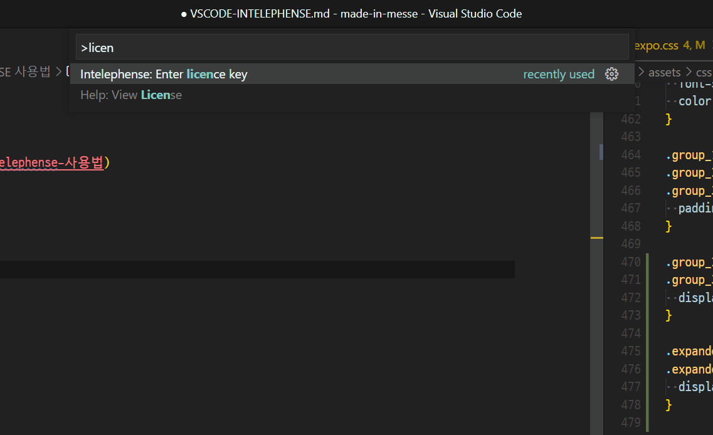

2. 라이센스키를 입력합니다
  

3. vscode extensions 탭(단축키 `ctrl + shift + x`)에서 `@builtin php` 로 검색하여 built-in 된 php 확장을 끕니다
  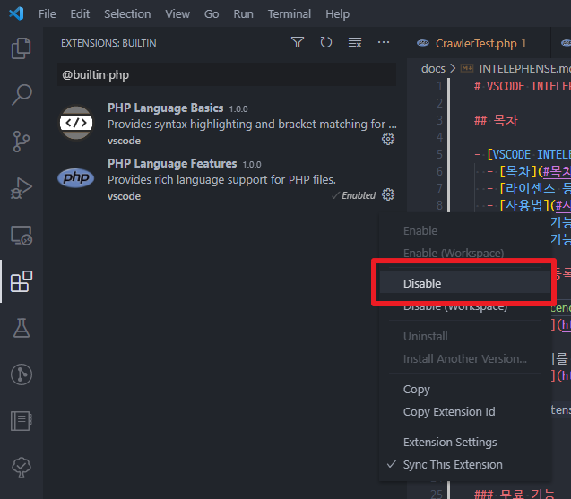

## 사용법

### 코드 분석

- 목적
  - 불필요한 정보검색을 줄이고 빠르게 공식문서 접근을 도와줌
- 도와주는 기능
  - 마우스 Hover를 통한 PHP 공식 문서 확인 `(마우스 Hover)`
    - 공식 문서를 사용하여 정확한 예제를 알고 싶을 때 유용
    - [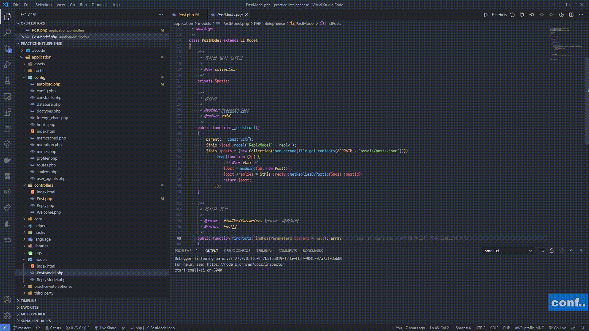](https://youtu.be/tUZS7mwnfmc)
  - 선언 (Declaration) 이동 `(F12)`
    - 해당 변수가 만들어진 시작점으로 바로 이동 가능함
    - [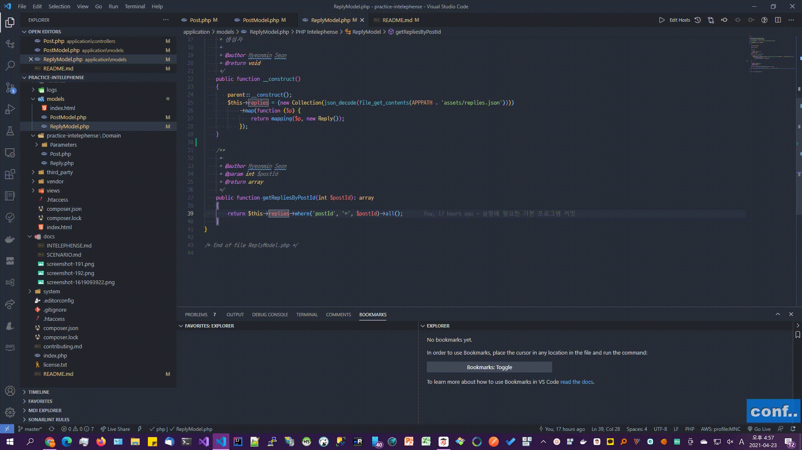](https://youtu.be/sQoUpZuALVY)
  - 파일 검색 `(Ctrl + p)`
    - 디렉토리 + 파일 조합으로 원하는 파일로 쉽게 이동 가능
    - FILE SEARCH
  - 해당 페이지 기호 검색 `(Ctrl + Shift + o)`
    - 해당 페이지에서 클래스, 메서드, 변수, 함수 등을 검색
    - LOCAL SYMBOL
  - 전역 기호(Symbol) 검색 `(Ctrl + t)`
    - 위 기능과 같으나 클래스, 메서드, 변수 등을 자유자재로 이동 가능
    - [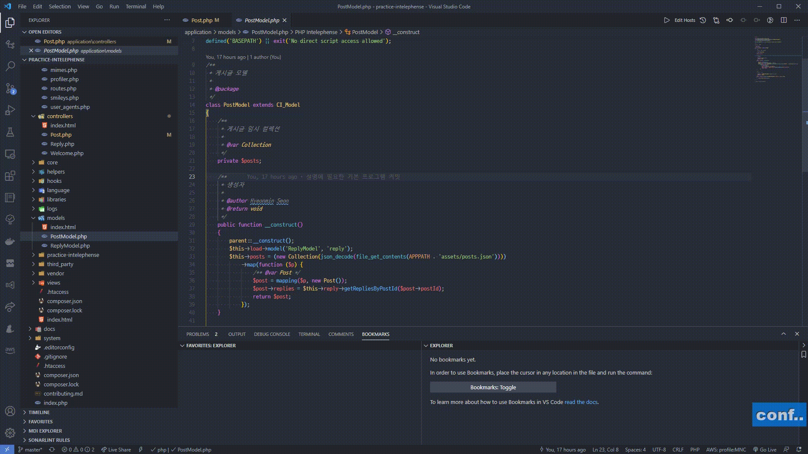](https://youtu.be/vPpFeioyFTw)
  - 코드 접고/펴기 `(Ctrl + Shift + [, ])`, 전체 접고/펴기 `(Ctrl + k + Ctrl + 0/J)`
    - 해당 구역 내부(중괄호, 태그 시작~끝 영역 등)에서 수행하면 내부 코드를 안보이게 접게 해준다
    - [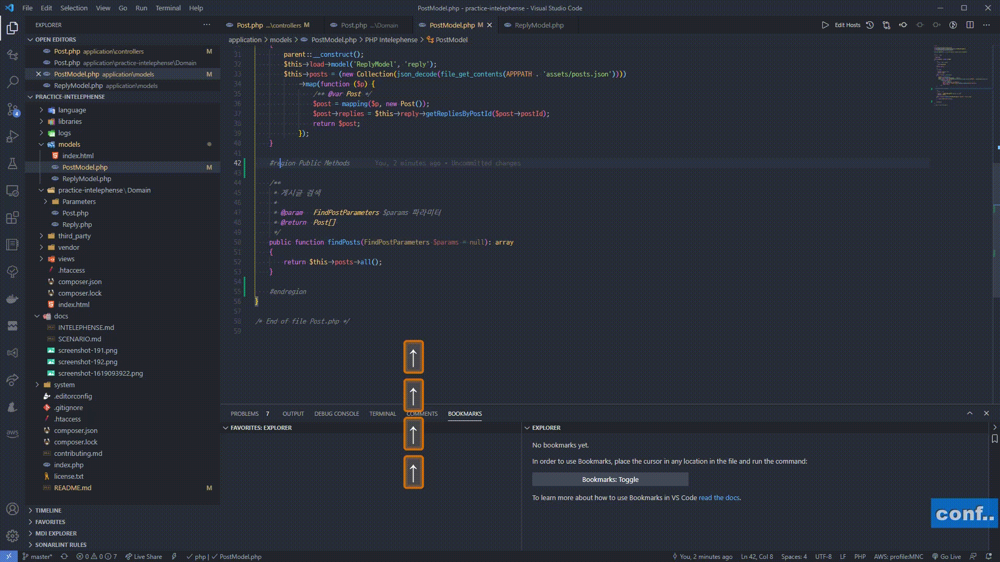](https://youtu.be/wtNpnmWJrQ8)
  - 정의(definition) 이동 `(F12)`
    - 상속 등을 통해서 오버로드 된 경우라면 해당 메서드의 선언부로 이동시켜준다. 정의 이동 기능과 동일하게 생각하면 됨
    - [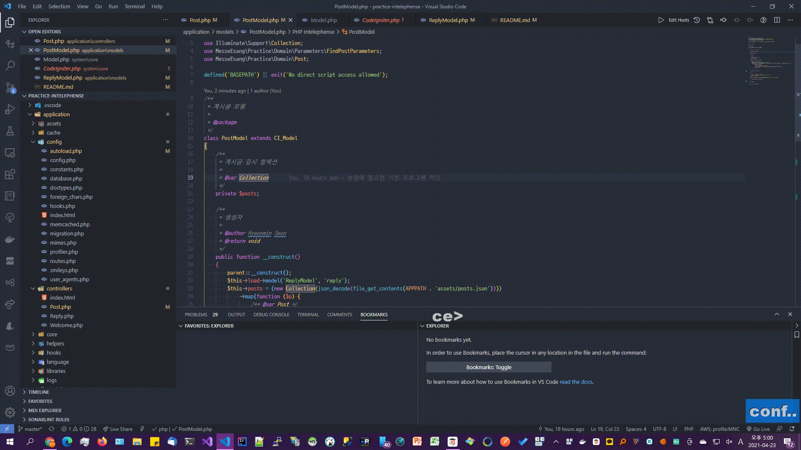](https://youtu.be/UhmNP2LwItQ)
  - 모든 구현체 찾기 `(Shift + F12)`
    - 해당 변수/메서드 등이 워크스페이스 내부에서 사용된 모든 코드들을 보여준다
    - [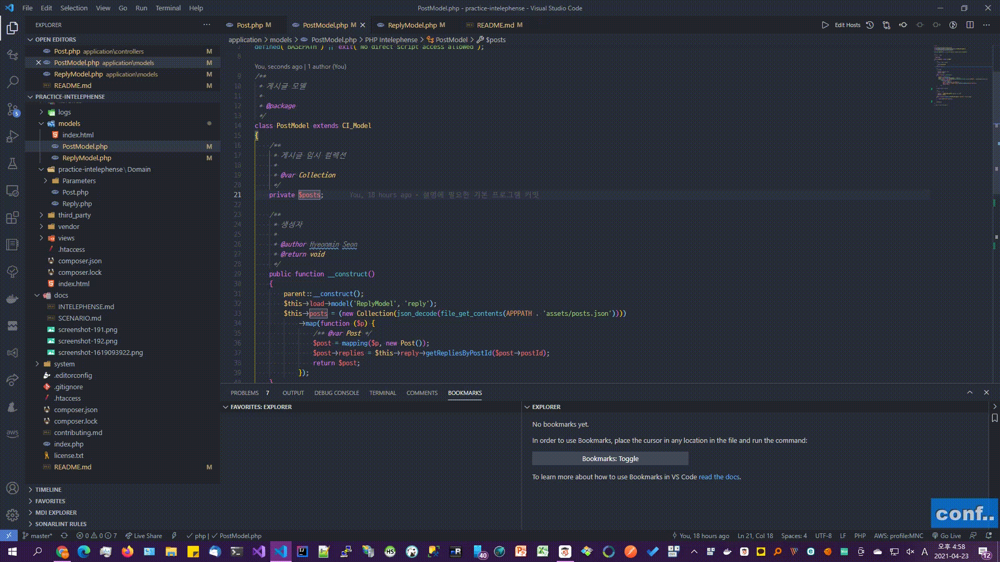](https://youtu.be/MKFHoQhhAUs)

### 코드 작성

- 목적
  - 빠른 코드 작성
- 도와주는 기능
  - 코드 자동 완성 `(Ctrl + Space)`
    - 사용하고자 하는 메서드, 변수명, 클래스 이름이 잘 생각안날 때 유용
    - 오탈자로 인한 오류를 줄여주는 효과도 있음
    - [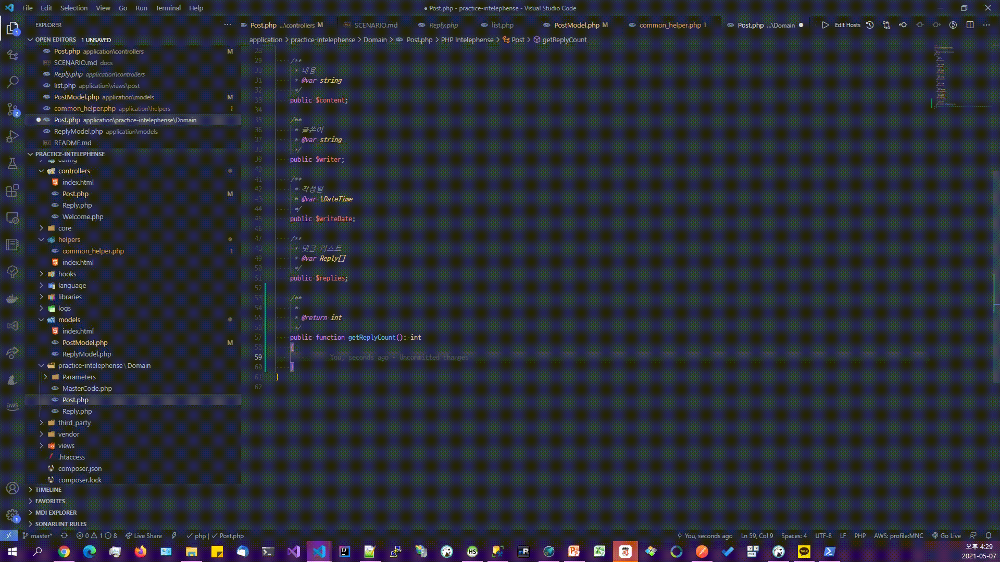](https://youtu.be/hKec9bj_W6k)
  - 코드 포메팅 `(Alt + Shift + f)`
    - 눈으로 읽기 좋은 코드를 손쉽게 만들어줌
    - [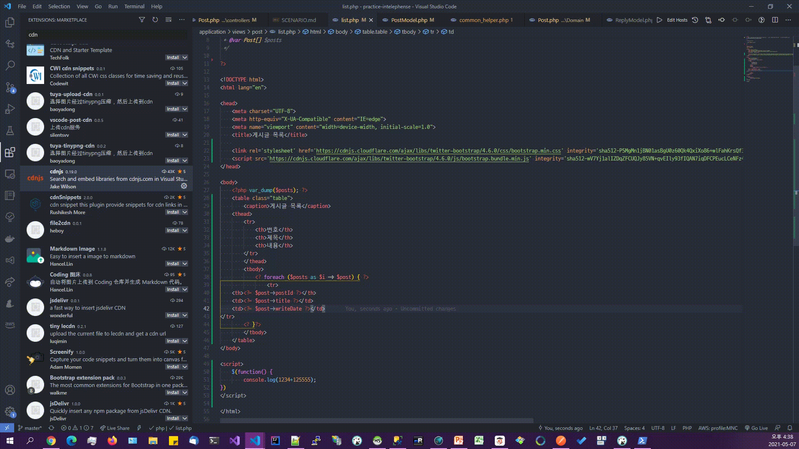](https://youtu.be/ndagPd2Iox4)
  - 자동 Import/Use `(Ctrl + .)`
    - 다른 네임스페이스에서 선언된 클래스/함수 등을 자동완성(Ctrl+Space) 를 통해 입력하면 자동으로 use문을 삽입해준다
    - 복사/붙여넣기 등을 통해서 붙여넣은 경우에 사용된 구문에 가서 `Ctrl + .` 을 입력하면 해당 이름을 갖는 클래스의 리스트를 보여주고 선택하면 자동으로 use문을 삽입해준다.
    - [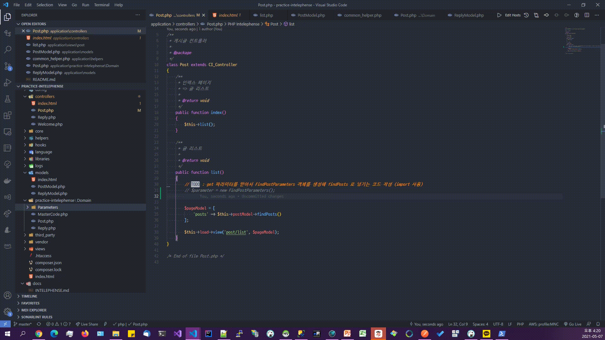](https://youtu.be/9FGPzRSpU3U)
  - PHP Doc 주석 작성 기능 `(/** 입력 후 Ctrl + Space)`
    - 메서드/클래스 위에서 /**를 입력하고 자동완성을 통해 `Intelephense PHP Doc` 을 선택하면 자동으로 PHP Doc 문서를 만들어준다
    - [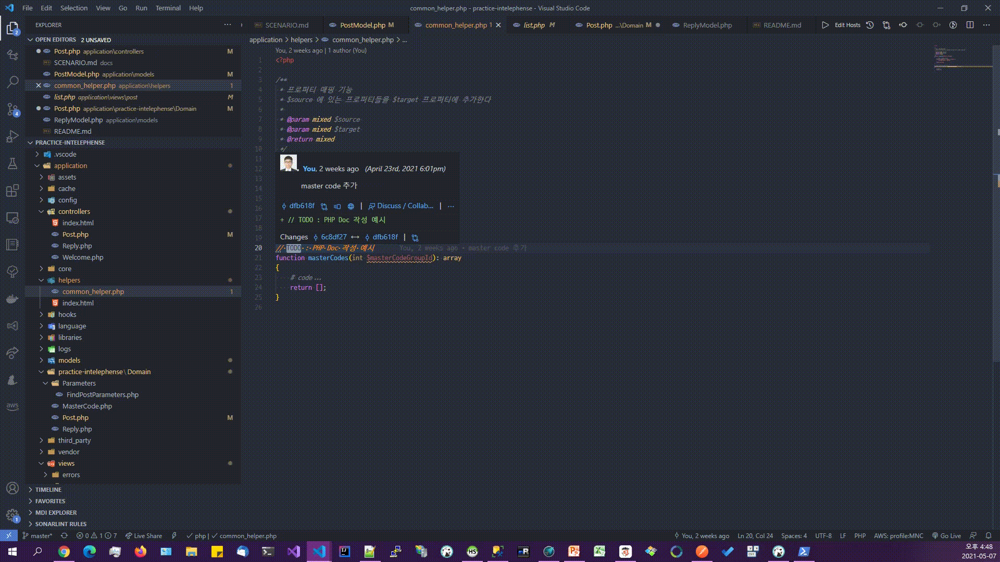](https://youtu.be/19702YCyPwI)
  - 이름 바꾸기 `(F2)`
    - 해당 개체의 scope 내에 해당하는 모든 변수/메서드/클래스의 이름을 변경하여 준다
    - 변수 이름 변경
      [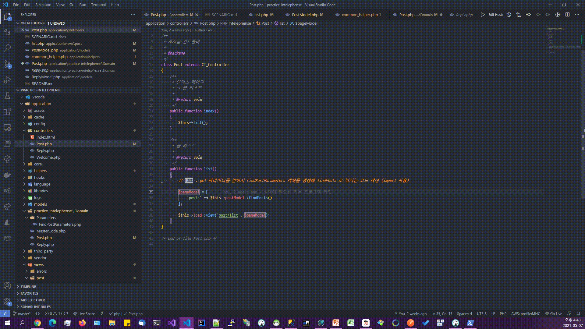](https://youtu.be/ojoYYvL3ad4)
    - 메서드 이름 변경
      [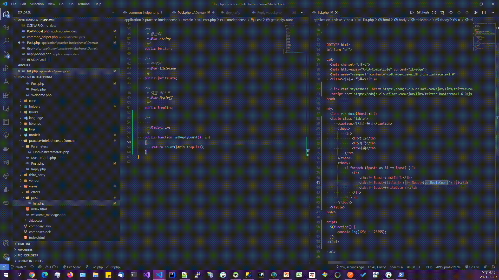](https://youtu.be/jjvThpEZCPQ)
    - 클래스 이름 변경 (파일명도 같이 바뀜)
      [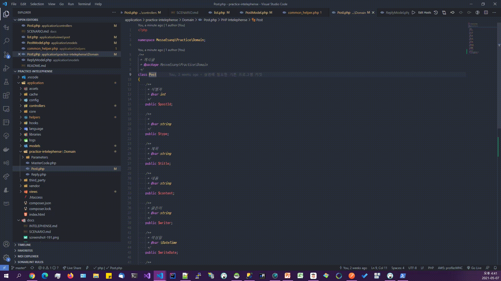](https://youtu.be/rKJD6mD8S0E)
